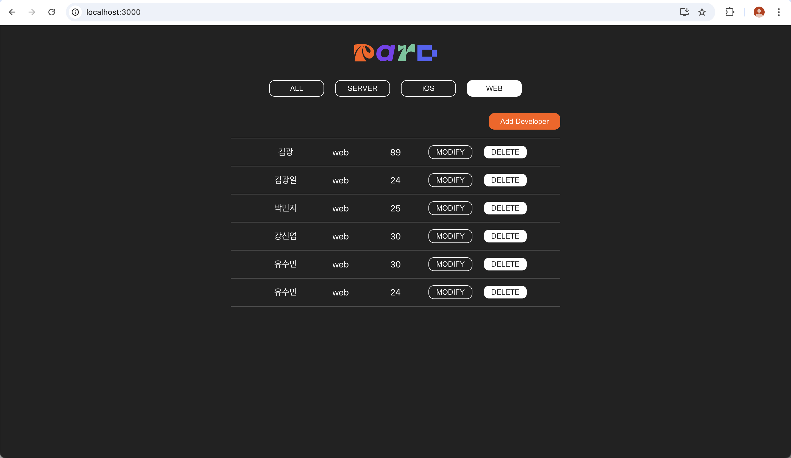
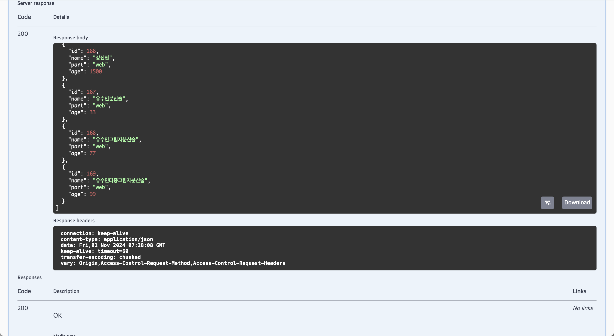

# PARD assignment 5: Axios project

1. 과제 목표
  - Axios의 GET, POST를 수행할 수 있다.
  - Swagger를 읽고 서버와의 통신을 진행할 수 있다.

2. 수행

    
  - .env 파일을 이용해 서버 url이 노출되는 것을 방지했습니다.
  - swagger를 이용해 서버를 살펴보았습니다.
    

    
swagger Screenshot 📷

    

      
    

    

    
  - Axios를 이용해 GET, POST하는 부분을 구현했습니다.