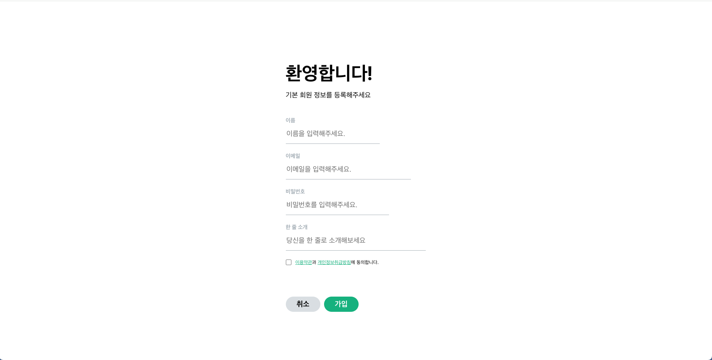

# [과제 1] Velog 가입 페이지 클론


## Overview 👀
과제: React를 사용해 Velog 자기소개 페이지 클론코딩 해보기

React의 styled components를 사용해봤다.

Styled components는 HTML, CSS, JS를 분리하는 것이 아니라 여러 개의 컴포넌트로 분리하고, 각 컴포넌트에 HTML, CSS, JS를 모두 넣는 패턴을 사용하는 라이브러리이다.

Props를 이용해 중복되는 코드들은 재사용하려고 노력했다.

<br>

## Building ⚙️
1. Repository 클론 및 폴더 이동(./pard_4th_kangshinyeob_velog/)
```shell
git clone https://github.com/4th-PARD-WEB-PART/KangShinyeob.git
cd ./pard_4th_kangshinyeob_velog
```

2. package 다운받기
```shell
npm install
```

3. 프로젝트 실행
```shell
npm start
```
<br>

## Screenshot 📷


<br>

## References 🤩
- [Styled component 개념 | Styled Components로 React 컴포넌트 스타일하기](https://www.daleseo.com/react-styled-components/)
- [Styled component 내부 문법 | React Styled-Components-a Basic Guide](https://medium.com/@personnamedmike/react-styled-components-a-basic-guide-2e03c7bbbfcd)
- [label 태그에 :focus pseudo class로 스타일 적용하기 | (stackoverflow) Anyway to have a label respond to :focus CSS](https://stackoverflow.com/questions/5978239/anyway-to-have-a-label-respond-to-focus-css)