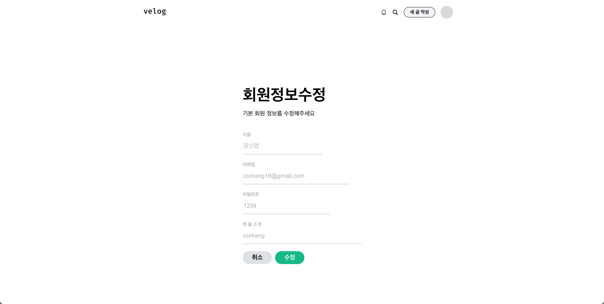

# 🏄🏻‍♂️ PARD Web 파트 과제: Velog 클론 코딩

## Overview 👀
React를 사용해 Velog 클론 코딩 해보기

- Week 02: RegisterPage
- Week 03: FeedPage

<br>

## Building ⚙️
1. Repository 클론 및 폴더 이동(./pard_4th_kangshinyeob_velog/)
```shell
git clone https://github.com/4th-PARD-WEB-PART/KangShinyeob.git
cd ./pard_4th_kangshinyeob_velog
```

2. package 다운받기
```shell
npm install
```

3. 프로젝트 실행
```shell
npm start
```
<br>


## Progress 🏃🏼‍♂️
### Week 02: RegisterPage.js
1. 조건
  - styled components 사용해보기
  
2. 구현

- <details>
  <summary>Screenshot 📷</summary>
  <div>

  

  </div>
</details>

- 중복되는 코드들이 있어 props를 이용해 코드를 재사용하려고 노력했다.
- :focus 가상 클래스를 input과 연결된 label 태그에도 연결하는 것이 어려웠다. <br>
label 태그에는 :focus 가상 클래스 바로 적용되지 않았기 때문에, label 태그와 input 태그의 순서를 바꾸고 '+'(인접 형제 결합자; next-sibling combinator)를 이용해 구현했다.

3. References
- [Styled component 개념 | Styled Components로 React 컴포넌트 스타일하기](https://www.daleseo.com/react-styled-components/)
- [Styled component 내부 문법 | React Styled-Components-a Basic Guide](https://medium.com/@personnamedmike/react-styled-components-a-basic-guide-2e03c7bbbfcd)
- [label 태그에 :focus pseudo class로 스타일 적용하기 | (stackoverflow) Anyway to have a label respond to :focus CSS](https://stackoverflow.com/questions/5978239/anyway-to-have-a-label-respond-to-focus-css)

### Week 03: FeedPage.js
1. 조건
  - Hook 라이브러리 사용하기
  - Props 개념 사용하기

2. 구현
- <details>
  <summary>Screenshot 📷</summary>
  <div>

  

  </div>
</details>

- 원래 레이아웃 잡을 때 `display: flex` 를 주로 사용해서, 불필요한 `<div>` 태그 중첩이 너무 많아 보였다. `margin: auto;` 개념을 학습했고, 두 방법을 잘 조합 해 코드 중첩을 줄일 수 있었다.
- 글 부분(Post)을 컴포넌트화 해서 props를 이용해 코드 중복을 많이 줄였다. Header 부분과 Nav 부분도 컴포넌트화 한다면 더 잘 짜여진 코드를 만들 수 있을 것 같다.
- 리액트 훅(Hook) `useState()`를 사용해 하트 버튼을 구현했다.
- react-icons 라이브러리를 이용해 이미지 사용을 줄이고 필요한 아이콘들을 쉽게 가져올 수 있었다.

3. References
- [react icons](https://react-icons.github.io/react-icons/)
- [[CSS] 마우스오버 시 손모양 커서로 바꾸기 - curser 속성](https://ming-jee.tistory.com/65)
- [react에서 inline style 사용 | [React][Style] 인라인스타일에 관하여
](https://velog.io/@zero_mountain/ReactStyle-%EC%9D%B8%EB%9D%BC%EC%9D%B8%EC%8A%A4%ED%83%80%EC%9D%BC%EC%97%90-%EA%B4%80%ED%95%98%EC%97%AC)
- [CSS-in-JS에서 삼항 연산자 사용 | 스타일드 컴포넌트 조건부 렌더링 활용하기](https://junheedot.tistory.com/entry/%EC%8A%A4%ED%83%80%EC%9D%BC%EB%93%9C-%EC%BB%B4%ED%8F%AC%EB%84%8C%ED%8A%B8-%EC%A1%B0%EA%B1%B4%EB%B6%80-%EB%A0%8C%EB%8D%94%EB%A7%81-%ED%99%9C%EC%9A%A9%ED%95%98%EA%B8%B0)
- [onClick에 함수 여러 개 연결 | [TIL] React 버튼 onClick 기능에 함수 2개 주고 싶어..
](https://velog.io/@daydreamplace/TIL-React-%EB%B2%84%ED%8A%BC-onClick-%EA%B8%B0%EB%8A%A5%EC%97%90-%ED%95%A8%EC%88%98-2%EA%B0%9C-%EC%A3%BC%EA%B3%A0-%EC%8B%B6%EC%96%B4)


### Week 04: DetailPage.js
1. 조건
  - Router 이용해 페이지 간 이동 구현하기
  - 하드코딩 X, 객체 이용해 정보 전달하기

2. 구현
- <details>
  <summary>Screenshot 📷</summary>
  <div>

  

  </div>
</details>

- 지난 세미나에서 배운 중첩 라우터와 URL 파라미터를 사용해봤다. Header가 여러 페이지에서 반복적으로 사용되므로 중첩 라우터를 도입했는데, 페이지마다 달라져야 하는 부분이 있어서 중첩 라우터를 사용하기 애매한 부분이 있었다. URL 파라미터의 여부에 따라 바뀌도록 구현했다.
- 필요한 정보를 URL 파라미터로 주고받았는데, 전역 상태를 관리할 수 있는 상태 관리 라이브러리를 사용한다면 더 목적과 의도에 적합하게 코드를 짤 수 있을 것 같다.
- 하드코딩 해두었던 컴포넌트로 전달되는 값들을 객체와 변수를 통해 전달되도록 구현했다. 변경 과정에서 배열 전개 연산자를 사용했는데, 자바스크립트가 제공하는 이러한 기능을 잘 활용하면 좋을 것 같다.
- 이번에는 Chat GPT를 많이 사용했다. 컴포넌트 이름을 소문자로 시작해서 발생한 오류, export와 import의 형식이 일치하지 않아 발생한 오류 등 주로 오류 해결에 도움을 받았고, JS에서 객체와 맵의 차이, Header를 중첩 라우터를 이용해 호출하는 방법과 컴포넌트를 호출하는 방법 간의 차이와 장단점 등 여러 방식으로 구현 가능한 경우 각 방식 간에 차이와 장단점을 비교하는데 도움을 받았다. 단순히 코드를 물어보기보다는 개념 학습이나 구체적인 사용법을 찾을 때 유용한 것 같다.

3. References
- [position: sticky로 Floating 버튼 만들기](https://gahyun-web-diary.tistory.com/292)


### Week 05: EditPage.js
1. 조건
  - recoil 이용해 전역상태 관리하기
  - router 이용해 페이지 이동하기

2. 구현
- <details>
  <summary>Screenshot 📷</summary>
  <div>

  

  </div>
</details>

- RegisterPage: 지난 주 과제였던 회원가입 validation logic을 수정했다. 제출 버튼을 클릭해도 상태 값이 바로 변하지 않고 두 번 버튼을 눌러야 값이 변경되는 문제가 있었는데, React의 상태 업데이트가 비동기적으로 이루어지기 때문이라는 것을 알게 되었다. setName()을 호출해도 상태가 바로 업데이트되지 않고 다음 렌더링에서 반영되는 식이다. 따라서 `<Input>`에 `value`, `onChange`를 추가해 입력된 값을 바로 저장해서 validation에 사용했다.
- FeedPage: 파일 내에 저장해두었던 더미 데이터들을 Atom 파일에 옮겨 전역 상태로 만들었다. 옮기는 과정에서 자바스크립트의 array와 object 개념과 그 차이점을 이해했다.
- DetailPage: 일단 RegisterPage 코드를 가져와 구현했다.

- TODO
    - Layouts/UserInfoInput.js 파일 만들어 RegisterPage와 DetailPage에 중복으로 사용된 코드 제거
    - validation 통과 못하면 빨간색으로 문제 있는 부분 색 변경
    - recoil 새로고침 문제 해결

3. References
- [Recoil 객체 값 업데이트](https://devpluto.tistory.com/entry/React-recoil%EB%A1%9C-%EC%A3%BC%EB%AC%B8%EB%82%B4%EC%97%AD-%EA%B4%80%EB%A6%AC%ED%95%98%EA%B8%B0)
- [onChange 이벤트](https://wouldyou.tistory.com/87)
- [Recoil 200% 활용하기](https://velog.io/@juno7803/Recoil-Recoil-200-%ED%99%9C%EC%9A%A9%ED%95%98%EA%B8%B0)
- [Recoil 새로고침 랜더링 문제](https://velog.io/@sean2337/Trouble-Shooting-Recoil-%EC%83%88%EB%A1%9C%EA%B3%A0%EC%B9%A8-%EB%9E%9C%EB%8D%94%EB%A7%81-%EB%AC%B8%EC%A0%9C)
